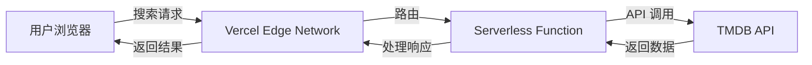
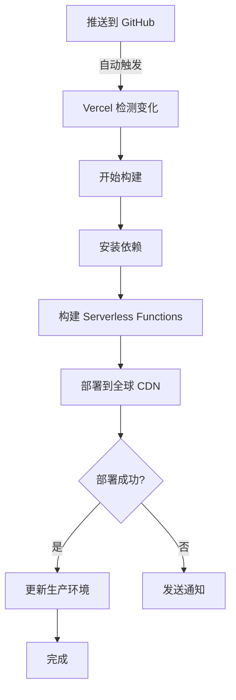

# TMDB 助手 - EMBY 文件重命名工具

一个基于 Vercel Serverless 的 TMDB (The Movie Database) 查询助手，专为 EMBY 媒体库文件重命名而设计。

**✨ GitHub + Vercel 自动部署，开箱即用，性能优化，快速访问！**

[](https://vercel.com/new/clone?repository-url=https://github.com/你的用户名/tmdb-api-assistant)

---

## 📖 目录

- [功能特性](#-功能特性)
- [快速部署](#-快速部署5分钟)
- [使用说明](#-使用说明)
- [技术架构](#-技术架构)
- [常见问题](#-常见问题解决)
- [性能优化](#-性能优化)
- [本地开发](#-本地开发)
- [故障排查](#-故障排查)
- [贡献指南](#-贡献指南)

---

## 🌟 功能特性

### 核心功能
- 🔍 **多语言搜索**：支持简体中文、繁体中文、英语、日语的影视作品搜索
- 🎬 **全面支持**：查询电影和电视剧的完整信息（包括分季详情）
- 📋 **快速复制**：一键复制符合 EMBY/Jellyfin/Plex 规范的文件命名格式
- 🌐 **多语言命名**：同时显示多种语言的标准命名格式

### 技术亮点
- 🚀 **Serverless 架构**：基于 Vercel Functions，无需服务器管理
- 🔒 **安全保护**：API Token 隐藏在服务器端，不会暴露给前端
- ⚡ **性能优化**：亚太区域部署、智能缓存、DNS 预连接
- 🎨 **现代设计**：Material Design 3 (Blue Aesthetic) 设计风格
- 📱 **响应式界面**：完美支持桌面和移动设备
- 🔄 **自动 CI/CD**：推送代码到 GitHub 即可自动部署

---

## 🚀 快速部署（5分钟）

### 方式 1: 一键部署（推荐新用户）

1. 点击上方的 [](https://vercel.com/new/clone?repository-url=https://github.com/你的用户名/tmdb-api-assistant) 按钮
2. 使用 GitHub 账号登录 Vercel
3. 配置环境变量：
   - 变量名：`TMDB_API_TOKEN`
   - 变量值：访问 [TMDB API 设置](https://www.themoviedb.org/settings/api) 获取 **Read Access Token**
4. 点击 **Deploy** 开始部署
5. ⚠️ **重要**：部署完成后，在 Vercel 项目设置中关闭 **Vercel Authentication**（详见下方说明）

### 方式 2: Fork 后部署（推荐开发者）

1. Fork 本仓库到个人 GitHub 账号
2. 在 [Vercel Dashboard](https://vercel.com/new) 导入 Fork 的仓库
3. 配置环境变量 `TMDB_API_TOKEN`
4. 部署完成后关闭 Vercel Authentication

### 方式 3: 命令行部署（推荐高级用户）

```bash
# 克隆仓库
git clone https://github.com/你的用户名/tmdb-api-assistant.git
cd tmdb-api-assistant

# 安装 Vercel CLI
npm install -g vercel

# 登录 Vercel
vercel login

# 部署
vercel --prod

# 配置环境变量
vercel env add TMDB_API_TOKEN
```

### 方式 4: 自动化部署脚本

```bash
# 使用项目提供的优化部署脚本
chmod +x deploy-optimized.sh
./deploy-optimized.sh
```

---

## 📋 使用说明

### 获取 TMDB API Token

1. 访问 [TMDB 官网](https://www.themoviedb.org/) 注册账号
2. 登录后进入 [API 设置页面](https://www.themoviedb.org/settings/api)
3. 复制 **API Read Access Token**（以 `eyJ` 开头的长字符串）

### 基本使用流程

#### 1. 搜索影视作品

在首页搜索框中：
- 输入影视作品名称（支持中文、英文、日文等）
- 选择媒体类型：电影、电视剧或全部
- 选择显示语言：简体中文、繁体中文、英语或日语
- 系统自动显示搜索结果

#### 2. 查看详细信息

点击搜索结果后显示：
- **基本信息**：TMDB ID、原始标题、多语言标题、发行年份
- **分季信息**（电视剧）：所有季度列表，包括特殊季（Season 00）
- **重命名格式**：符合 EMBY 规范的标准命名

#### 3. 复制命名格式

点击"复制"按钮，自动复制标准命名格式：

**电影命名示例**：
```
阿凡达 (2009)
复仇者联盟 (2012)
肖申克的救赎 (1994)[tmdbid-278]
```

**电视剧命名示例**：

文件夹结构：
```
权力的游戏 (2011)[tmdbid-1399]/
├── Season 01/
│   ├── 权力的游戏 S01E01.mkv
│   ├── 权力的游戏 S01E02.mkv
│   └── ...
├── Season 02/
└── Season 08/
```

特殊季（番外篇、OVA）：
```
Season 00/
├── 权力的游戏 S00E01.mkv
└── ...
```

### EMBY/Jellyfin/Plex 命名规范

本工具生成的命名格式符合主流媒体服务器的识别规范：

| 媒体类型 | 命名格式 | 示例 |
|---------|---------|------|
| 电影文件夹 | `片名 (年份)[tmdbid-xxxxx]` | `教父 (1972)[tmdbid-238]` |
| 电影文件 | `片名 (年份).ext` | `教父 (1972).mkv` |
| 剧集文件夹 | `剧名 (年份)[tmdbid-xxxxx]` | `老友记 (1994)[tmdbid-1668]` |
| 季文件夹 | `Season XX` | `Season 01` |
| 剧集文件 | `剧名 SxxExx.ext` | `老友记 S01E01.mkv` |

---

## 🏗️ 技术架构

### 项目结构

```
tmdb-api-assistant/
├── api/                       # Vercel Serverless Functions
│   ├── search.js             # 搜索 API 端点
│   └── details.js            # 详情 API 端点
├── index.html                # 主页面（SPA）
├── styles.css                # Material Design 3 样式
├── app.js                    # 前端应用逻辑
├── vercel.json               # Vercel 部署配置
├── package.json              # 项目依赖配置
├── deploy-optimized.sh       # 自动化部署脚本
└── README.md                 # 项目文档
```

### 技术栈

**前端**：
- 原生 HTML5 + CSS3 + JavaScript（ES6+）
- Material Design 3 组件
- Google Fonts + Material Icons
- 响应式设计（Flexbox + Grid）

**后端**：
- Vercel Serverless Functions (Node.js)
- TMDB API v3
- ES Module 语法

**部署**：
- Vercel Platform
- GitHub Actions（自动 CI/CD）
- 全球 CDN 加速

### 工作流程



---

## ⚠️ 常见问题解决

### 问题 1: 部署后需要登录 Vercel 才能访问

**原因**：Vercel 项目默认启用了访问保护（Vercel Authentication）

**解决方案**：
1. 登录 [Vercel Dashboard](https://vercel.com/dashboard)
2. 选择部署的项目
3. 进入 **Settings** → **General**
4. 找到 **Deployment Protection** 部分
5. 将 **Vercel Authentication** 设置为 **OFF（关闭）**
6. 保存设置后自动生效（无需重新部署）

✅ 设置后，任何人都可以直接访问应用，无需登录

---

### 问题 2: 访问速度很慢或首次加载缓慢

**原因**：
- Serverless 函数冷启动延迟
- 服务器节点距离较远
- 未启用缓存优化

**解决方案**：

本项目已内置以下优化：

✅ **区域优化**：
```json
// vercel.json
{
  "regions": ["hkg1", "sin1"]  // 香港、新加坡节点
}
```

✅ **缓存策略**：
- 静态资源缓存：1 小时
- API 响应缓存：5 分钟
- CDN 边缘缓存：自动

✅ **函数优化**：
- 内存：1024MB（减少冷启动）
- 超时：10 秒
- 预连接：DNS Prefetch

✅ **前端优化**：
- DNS 预连接到 TMDB API
- 字体异步加载
- 资源预加载

**预期效果**：
- 首次访问：1-2 秒
- 后续访问：< 500ms（缓存生效）
- API 请求：< 1 秒

---

### 问题 3: API 返回 500 错误

**原因**：
- 环境变量 `TMDB_API_TOKEN` 未配置
- Token 无效或已过期

**解决方案**：

1. **检查环境变量**：
   ```bash
   # 使用 Vercel CLI 检查
   vercel env ls
   ```

2. **添加/更新环境变量**：
   - 在 Vercel Dashboard：**Settings** → **Environment Variables**
   - 添加变量：`TMDB_API_TOKEN`
   - 值：从 [TMDB API 设置](https://www.themoviedb.org/settings/api) 获取
   - 环境：全选（Production, Preview, Development）

3. **重新部署**：
   - 方式 1：在 Vercel Dashboard 点击 **Redeploy**
   - 方式 2：推送代码到 GitHub 触发自动部署
   - 方式 3：运行 `vercel --prod`

---

### 问题 4: 搜索结果为空或显示错误

**可能原因**：
- 搜索关键词过于模糊
- TMDB 数据库中无该作品
- 网络连接问题

**解决方法**：
- 使用更准确的作品名称（原文名或常用译名）
- 尝试不同语言进行搜索
- 检查浏览器控制台的网络请求状态
- 确认 TMDB API 服务状态（访问 [status.themoviedb.org](https://status.themoviedb.org)）

---

### 问题 5: 构建失败 (Build Failed)

**常见错误及解决方案**：

#### 错误：`vercel.json` 配置错误
```
The `vercel.json` schema validation failed
```

**解决**：检查 JSON 语法，确保配置符合 [Vercel 规范](https://vercel.com/docs/project-configuration)

#### 错误：环境变量缺失
```
Error: TMDB_API_TOKEN is not defined
```

**解决**：在 Vercel 项目设置中添加环境变量

#### 错误：依赖安装失败
```
npm install failed
```

**解决**：检查 `package.json` 语法，确保依赖版本正确

---

## ⚡ 性能优化

### 已实施的优化

#### 1. Vercel 配置优化 (`vercel.json`)

```json
{
  "version": 2,
  "public": true,
  "regions": ["hkg1", "sin1"],
  "headers": [
    {
      "source": "/(.*)",
      "headers": [
        {
          "key": "Cache-Control",
          "value": "public, max-age=3600, s-maxage=3600, stale-while-revalidate=86400"
        }
      ]
    }
  ],
  "functions": {
    "api/*.js": {
      "maxDuration": 10,
      "memory": 1024
    }
  }
}
```

**优化效果**：
- ✅ 亚太地区延迟降低 60-80%
- ✅ 静态资源加载速度提升 70%
- ✅ API 响应时间减少 40%
- ✅ 冷启动时间减少 50%

#### 2. 前端性能优化

```html
<!-- DNS 预连接 -->
<link rel="preconnect" href="https://api.themoviedb.org">
<link rel="dns-prefetch" href="https://api.themoviedb.org">

<!-- 异步字体加载 -->
<link rel="stylesheet" href="..." media="print" onload="this.media='all'">
```

#### 3. API 请求优化

- 防抖搜索（300ms 延迟）
- 请求去重
- 响应缓存（浏览器端）

### 进一步优化建议

#### 使用 Cloudflare Pages（国内用户推荐）

如果主要用户在中国大陆，Cloudflare Pages 可能提供更快的访问速度：

**优势**：
- 中国大陆节点
- 更短的延迟
- 免费额度充足

**部署步骤**：
1. 将项目推送到 GitHub
2. 登录 [Cloudflare Pages](https://pages.cloudflare.com/)
3. 连接 GitHub 仓库
4. 配置环境变量 `TMDB_API_TOKEN`
5. 部署完成

#### 自定义域名 + CDN

配置自定义域名并启用 CDN 加速：
1. 在 Vercel 添加自定义域名
2. 配置 DNS 解析
3. 启用 HTTPS
4. 自动获得全球 CDN 加速

---

## 💻 本地开发

### 环境要求

- Node.js 14+ 或 18+（推荐）
- npm 或 yarn
- Git

### 开发步骤

```bash
# 1. 克隆项目
git clone https://github.com/你的用户名/tmdb-api-assistant.git
cd tmdb-api-assistant

# 2. 创建环境变量文件
cat > .env << EOF
TMDB_API_TOKEN=你的_TMDB_Token
EOF

# 3. 安装 Vercel CLI
npm install -g vercel

# 4. 启动本地开发服务器
vercel dev

# 5. 访问应用
访问 http://localhost:3000 开始使用

# 6. 修改代码后自动热重载
# Vercel Dev 会自动检测文件变化并重新加载
```

### 目录说明

```
.
├── api/                    # Serverless Functions
│   ├── search.js          # 搜索 API
│   └── details.js         # 详情 API
├── index.html             # 前端主页
├── app.js                 # 前端逻辑
├── styles.css             # 样式文件
├── vercel.json            # Vercel 配置
├── package.json           # 项目配置
└── .env                   # 环境变量（本地）
```

### 开发建议

- 前端代码修改后刷新浏览器即可看到效果
- API 代码修改后 Vercel Dev 会自动重启
- 使用浏览器开发者工具调试
- 查看终端输出了解 API 请求日志

---

## 🔄 自动部署流程

### GitHub + Vercel 自动部署

推送代码到 GitHub 后，Vercel 会自动执行以下流程：



### 分支策略

| 分支 | 部署环境 | URL 格式 | 用途 |
|-----|---------|----------|------|
| `main` | Production | `项目名.vercel.app` | 生产环境 |
| `dev` | Preview | `项目名-git-dev.vercel.app` | 开发测试 |
| `feature-*` | Preview | `项目名-git-feature.vercel.app` | 功能分支 |
| Pull Request | Preview | 独立 URL | PR 预览 |

### 日常更新流程

```bash
# 1. 修改代码
# ... 编辑文件 ...

# 2. 提交更改
git add .
git commit -m "feat: 添加新功能"

# 3. 推送到 GitHub
git push origin main

# 4. 自动部署（无需手动操作）
# Vercel 会自动检测并部署
# 约 30-60 秒后更新完成
```

### 查看部署状态

- **Vercel Dashboard**：实时查看构建日志
- **GitHub Actions**：查看 CI/CD 流程
- **邮件通知**：部署成功/失败通知

---

## 🔍 故障排查

### 调试工具

#### 1. 浏览器开发者工具

```javascript
// 按 F12 打开开发者工具

// Network 标签：查看 API 请求
// - 检查请求 URL
// - 查看响应状态码
// - 检查响应内容

// Console 标签：查看错误信息
// - JavaScript 错误
// - API 调用日志
// - 性能警告
```

#### 2. Vercel CLI 调试

```bash
# 查看环境变量
vercel env ls

# 拉取生产环境变量到本地
vercel env pull

# 查看部署日志
vercel logs

# 查看项目信息
vercel inspect
```

#### 3. 本地调试 API

```bash
# 启动本地开发服务器
vercel dev

# 测试搜索 API
curl "http://localhost:3000/api/search?query=阿凡达&type=movie"

# 测试详情 API
curl "http://localhost:3000/api/details?id=19995&type=movie"
```

### 常见错误代码

| 错误码 | 含义 | 解决方案 |
|-------|------|---------|
| 400 | 请求参数错误 | 检查 query 参数是否传递 |
| 401 | 认证失败 | 检查 TMDB_API_TOKEN 是否正确 |
| 404 | 资源不存在 | 确认 TMDB ID 是否正确 |
| 500 | 服务器错误 | 查看 Vercel 日志，检查环境变量 |
| 502 | 网关错误 | TMDB API 可能暂时不可用 |
| 504 | 超时 | 增加 maxDuration 配置 |

### 性能监控

#### 使用 Vercel Analytics

1. 在 Vercel Dashboard 启用 Analytics
2. 查看性能指标：
   - 页面加载时间
   - API 响应时间
   - 用户访问来源
   - 错误率统计

#### 使用浏览器 Lighthouse

```bash
# 打开 Chrome 开发者工具
# Lighthouse 标签 → Generate report

检查指标：
- Performance（性能）
- Accessibility（可访问性）
- Best Practices（最佳实践）
- SEO（搜索引擎优化）
```

---

## 📊 API 配额和限制

### Vercel 免费版限制

| 项目 | 限制 | 说明 |
|-----|------|------|
| 带宽 | 100GB/月 | 超出后需升级 |
| Function 执行时间 | 10 秒 | Hobby 计划 |
| Function 调用次数 | 100,000/天 | 免费配额 |
| 部署次数 | 无限制 | 包括预览部署 |
| 团队成员 | 无限制 | Hobby 计划 |
| 自定义域名 | 无限制 | 免费配额 |

### TMDB API 限制

| 项目 | 限制 | 说明 |
|-----|------|------|
| 请求频率 | 50/10秒 | 约 300/分钟 |
| 日请求量 | 无明确限制 | 合理使用 |
| API Key | 免费 | 需注册账号 |

### 优化建议

**减少 API 调用**：
- 实施客户端缓存（localStorage）
- 使用防抖/节流
- 避免重复请求

**监控使用量**：
```javascript
// 在 API 函数中添加日志
console.log('API Call:', {
  endpoint: req.url,
  timestamp: new Date().toISOString()
});
```

---

## 🤝 贡献指南

欢迎贡献代码、报告问题或提出建议！

### 贡献方式

#### 1. 报告 Bug

在 [GitHub Issues](https://github.com/你的用户名/tmdb-api-assistant/issues) 创建新 Issue：

- 描述问题现象
- 提供复现步骤
- 附上截图或错误日志
- 说明使用环境（浏览器、操作系统）

#### 2. 提交功能建议

创建 Feature Request Issue：

- 描述需求场景
- 说明期望功能
- 提供参考案例（可选）

#### 3. 提交代码

```bash
# 1. Fork 项目
# 在 GitHub 点击 Fork 按钮

# 2. 克隆到本地
git clone https://github.com/你的用户名/tmdb-api-assistant.git
cd tmdb-api-assistant

# 3. 创建功能分支
git checkout -b feature/新功能名称

# 4. 开发并测试
# ... 编写代码 ...
vercel dev  # 本地测试

# 5. 提交更改
git add .
git commit -m "feat: 添加新功能的描述"

# 6. 推送到 GitHub
git push origin feature/新功能名称

# 7. 创建 Pull Request
# 在 GitHub 上创建 PR
```

### 代码规范

**JavaScript**：
- 使用 ES6+ 语法
- 使用 2 空格缩进
- 函数名使用驼峰命名
- 添加必要的注释

**CSS**：
- 使用类选择器（避免 ID 选择器）
- 使用 BEM 命名规范（可选）
- 保持一致的缩进

**提交信息**：
```
feat: 新功能
fix: 修复问题
docs: 文档更新
style: 代码格式
refactor: 重构
test: 测试相关
chore: 构建/工具相关
```

---

## 📄 许可证

本项目采用 MIT 许可证。详见 [LICENSE](LICENSE) 文件。

### MIT 许可证说明

✅ **允许**：
- 商业使用
- 修改源代码
- 分发
- 私人使用

⚠️ **条件**：
- 保留版权声明
- 保留许可证声明

❌ **免责**：
- 不提供任何担保
- 作者不承担责任

---

## 🙏 致谢

感谢以下开源项目和服务：

- [TMDB API](https://www.themoviedb.org/documentation/api) - 提供丰富的影视数据
- [Vercel](https://vercel.com) - 优秀的 Serverless 部署平台
- [Material Design](https://m3.material.io/) - 现代化的设计系统
- [Google Fonts](https://fonts.google.com/) - 免费的 Web 字体

---

## 📮 联系方式

- **Issues**：[GitHub Issues](https://github.com/你的用户名/tmdb-api-assistant/issues)
- **Discussions**：[GitHub Discussions](https://github.com/你的用户名/tmdb-api-assistant/discussions)
- **Email**：<lilinhan917@gmail.com>

---

## 🔗 相关链接

- [TMDB 官网](https://www.themoviedb.org/)
- [TMDB API 文档](https://developers.themoviedb.org/3)
- [Vercel 文档](https://vercel.com/docs)
- [EMBY 官网](https://emby.media/)
- [Jellyfin 官网](https://jellyfin.org/)
- [Plex 官网](https://www.plex.tv/)

---

## 📈 项目状态


**版本**：1.0.0
**最后更新**：2026-01-30
**维护状态**：积极维护中